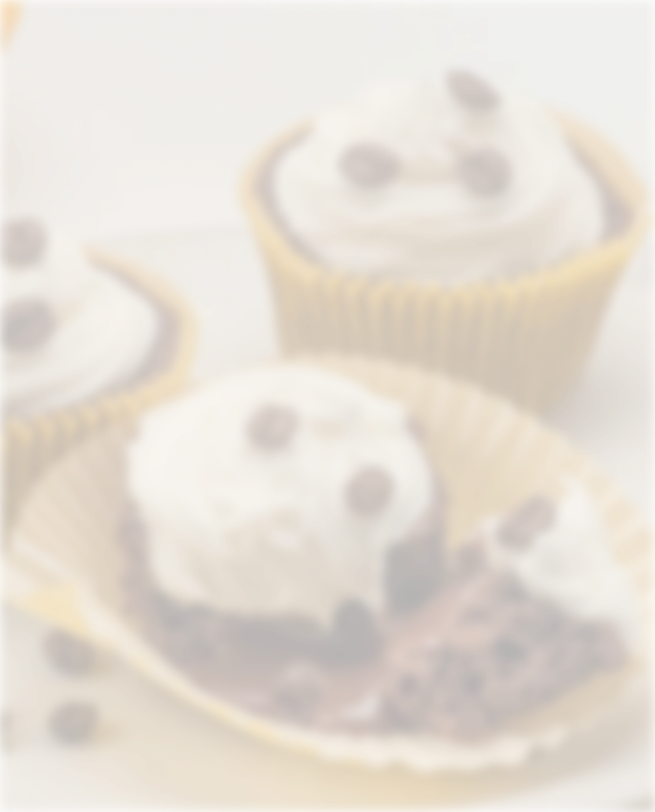
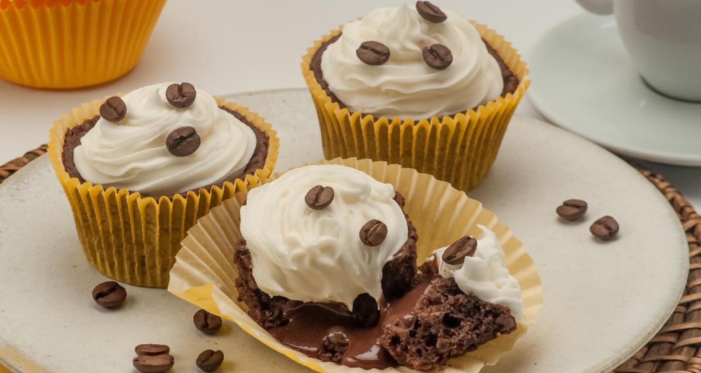

# Projeto Receitas

Bem-vindo ao **Projeto Receitas**! Este repositório contém o código-fonte de uma aplicação web para cadastro e visualização de receitas culinárias.

## 🎨 Paleta de Cores

O projeto utiliza uma paleta de cores moderna e agradável. Veja abaixo as principais cores e seus respectivos códigos:

--background-color: #573824;
--surface-color: #f0e8c2;
--text-color-primary: #291b1a;
--text-color-secondary: #573a37;
--text-color-on-bg: #f0e8c2;

## 🖼️ Imagens

As imagens utilizadas no projeto estão localizadas na pasta `/imagens`. Exemplos:

_Exemplo de receita cadastrada._

_Outra receita disponível na aplicação._

## 🚀 Tecnologias Utilizadas

- **HTML5** e **CSS3**
- **XAMPP** para ambiente local de desenvolvimento

## 📢 Acesse o Projeto!

Confira o projeto publicado e experimente cadastrar suas próprias receitas:

👉 [Acesse aqui o Projeto Receitas!](https://seuprojeto.com)
